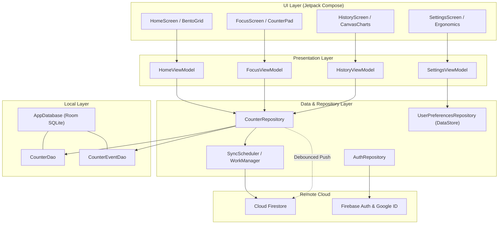

<div align="center">

# Keisuki (計好き)

### Expressive, Offline-First Multi-Counter & Habit Analytics for Android

[](https://github.com/hiashwinsharma/Keisuki/actions/workflows/ci.yml)
[](https://www.gnu.org/licenses/gpl-3.0)
[](https://kotlinlang.org)
[](https://developer.android.com/jetpack/compose)
[](https://developer.android.com/about/versions/oreo)
[](https://developer.android.com/about/versions/15)
[](https://github.com/hiashwinsharma/Keisuki/releases)

<p align="center">
  <a href="https://github.com/hiashwinsharma/Keisuki/releases">
    
  </a>
  <a href="https://play.google.com/store/apps/details?id=com.hiashwinsharma.keisuki">
    
  </a>
</p>

</div>

---

## Overview

**Keisuki** (derived from 計 *kei* – to measure/count, and 継続 *keizoku* – continuity/habit) is a modern, privacy-focused, offline-first Android counter and habit analytics application. Built entirely with **Jetpack Compose** and **Material 3 Expressive** design principles, Keisuki pairs fluid spring animations and tactile haptics with deep event-level telemetry and multi-window statistical charting.

Whether tracking daily rituals, habit loops, inventory tallies, or fitness repetitions, Keisuki provides an instant, zero-latency local database backed by background cloud synchronization to Firebase Firestore.

---

## Key Features

### Bento Grid & Expressive Design
* **Adaptive Bento Cards**: Visual hierarchy displaying count velocity, step increments, and customizable high-chroma color tokens (*Electric Rose, Hyper Cyan, Neon Jade, Sunburst Amber, Violet Flux, Deep Coral, Electric Lime*).
* **Dynamic Corner Radius**: Granular corner radius customization (from `0.dp` sharp edges to `32.dp` ultra-expressive curves) propagated dynamically across the design system.
* **AMOLED True Dark**: Deep pitch-black OLED theme alongside dynamic Material You dynamic color theming.

### Immersive Focus Mode
* **Dedicated Counter Canvas**: Minimalist full-screen interface designed for distraction-free rapid tallying.
* **Morph & Roll Motion**: Spring-physics action morphs with smooth `RollingNumberText` digit rolling animations.
* **Dynamic Step Selector**: Instant switching between customizable step increments (`+1`, `+5`, `+10`, custom steps).

### Custom Canvas Chart Engine & History Analytics
* **Touch-Scrubbable Time Series**: Custom Canvas rendering (`ChartCanvas`, `BatteryStyleChart`) with interactive touch scrubber pills and timestamp inspection.
* **Multi-Window Aggregation**: Analyze activity trends across Day, Week, Month, Year, and All-Time horizons.
* **Comprehensive Bento Stats**: Instant insights including total recorded taps, daily streaks, average count velocity, and peak activity timeframes.

### Offline-First Architecture & Cloud Sync
* **Local-First Speed**: All reads and writes hit Android Room SQLite instantly with zero network delay.
* **Debounced Cloud Mutation**: Intelligently throttles cloud mutations with a 1500ms debounce buffer to conserve mobile bandwidth and eliminate redundant database writes.
* **WorkManager Sync Worker**: Robust background synchronization handling intermittent connectivity and retries.
* **Modern Auth & Guest Mode**: Frictionless guest experience with seamless upgrade path via Google Identity Services (AndroidX Credentials) and Firebase Authentication.

### Ergonomics & Haptics
* **Hand Dominance Ergonomics**: Configurable bottom-sheet and control placement tailored for single-handed left- or right-hand ergonomics.
* **Multi-Tier Haptic Engine**: Custom tactile vibration profiles ranging from subtle ticks to heavy confirming clicks.

---

## Architecture

Keisuki follows the official **Android Architecture Guidelines** utilizing unidirectional data flow (UDF) with MVI-inspired UI state handling:



---

## Tech Stack & Libraries

| Category | Component / Tool | Details |
| :--- | :--- | :--- |
| **Language** | [Kotlin](https://kotlinlang.org/) | Modern Kotlin 2.0 with strict typing & Coroutines |
| **UI Framework** | [Jetpack Compose](https://developer.android.com/jetpack/compose) | Compose BOM `2024.09.00`, Material 3 Expressive |
| **Architecture** | Modern Android Architecture | ViewModel, StateFlow, Coroutines, MVI actions |
| **Database** | [Room](https://developer.android.com/training/data-storage/room) | Local SQLite persistence with DAO interfaces |
| **Background Work** | [WorkManager](https://developer.android.com/topic/libraries/architecture/workmanager) | Periodic & constraint-aware cloud synchronization |
| **Cloud Backend** | [Firebase](https://firebase.google.com/) | Cloud Firestore & Firebase Authentication |
| **Authentication** | [AndroidX Credentials](https://developer.android.com/training/sign-in/credential-manager) | Google Identity Services & Credential Manager |
| **Preferences** | [Jetpack DataStore](https://developer.android.com/topic/libraries/architecture/datastore) | Type-safe asynchronous preference storage |
| **Build Tool** | Gradle Kotlin DSL (`kts`) | Version Catalogs (`libs.versions.toml`), Android Gradle Plugin 8.7+ |

---

## Getting Started

### Prerequisites
* **Android Studio**: Ladybug (2024.2.1+) or Koala Feature Drop
* **JDK**: OpenJDK 17 or newer
* **Android SDK**: `minSdk 26` (Android 8.0 Oreo), `targetSdk 35` (Android 15)

### 1. Clone the Repository
```bash
git clone https://github.com/hiashwinsharma/Keisuki.git
cd Keisuki
```

### 2. Configure Firebase (Optional for Cloud Sync)
1. Go to the [Firebase Console](https://console.firebase.google.com/) and create a new project.
2. Add an Android app with package name `com.hiashwinsharma.keisuki`.
3. Download the generated `google-services.json` file and place it in the `/app` directory:
   ```bash
   cp ~/Downloads/google-services.json app/
   ```
4. Enable **Firestore Database** and **Authentication** (Google Sign-In & Anonymous) in your Firebase console.

*(Note: Keisuki functions out-of-the-box in local offline mode without Firebase configured.)*

### 3. Build & Run
Open the project in Android Studio or build directly from your terminal:

```bash
# Assemble Debug APK
./gradlew assembleDebug

# Run Unit Tests
./gradlew test

# Install Debug APK on connected device/emulator
./gradlew installDebug
```

---

## Project Structure

```text
Keisuki/
├── app/
│   ├── src/
│   │   ├── main/
│   │   │   ├── java/com/hiashwinsharma/keisuki/
│   │   │   │   ├── core/
│   │   │   │   │   ├── designsystem/   # Theme, Typography, Dynamic Shapes & Haptics
│   │   │   │   │   ├── model/          # Counter, SyncStatus & ColorToken domains
│   │   │   │   │   └── ui/             # Reusable UI widgets & custom Canvas Chart engine
│   │   │   │   ├── data/
│   │   │   │   │   ├── auth/           # Firebase & Credential Manager auth repository
│   │   │   │   │   ├── local/          # Room DB, Counter entities & DAO interfaces
│   │   │   │   │   ├── preferences/    # Ergonomics, Theme & Layout user preferences
│   │   │   │   │   ├── remote/         # Firestore service & cloud synchronization
│   │   │   │   │   └── sync/           # WorkManager periodic and debounced sync workers
│   │   │   │   ├── feature/
│   │   │   │   │   ├── auth/           # Auth bottom sheets & user sign-in flows
│   │   │   │   │   ├── focus/          # Fullscreen focus mode & step controls
│   │   │   │   │   ├── history/        # Time series chart canvas & stats bento
│   │   │   │   │   ├── home/           # Bento grid counter cards & quick action controls
│   │   │   │   │   └── settings/       # Theme, radius, ergonomics & data management
│   │   │   │   ├── KeisukiApp.kt       # Application container & dependency bootstrap
│   │   │   │   └── MainActivity.kt     # Single Activity entry point & Navigation host
│   │   │   └── res/                    # Drawables, mipmaps, and string resources
│   └── build.gradle.kts
├── gradle/
│   └── libs.versions.toml              # Centralized dependencies & plugins
├── .github/
│   ├── workflows/                      # GitHub Actions CI pipeline
│   ├── ISSUE_TEMPLATE/                 # Structured bug report & feature request forms
│   └── pull_request_template.md        # Pull request submission template
├── CONTRIBUTING.md                     # Contribution guidelines & coding conventions
├── CODE_OF_CONDUCT.md                  # Contributor Covenant v2.1 standard
├── SECURITY.md                         # Vulnerability disclosure & support policy
└── LICENSE                             # GNU General Public License v3.0
```

---

## Contributing

Contributions are warmly welcomed! Please check out [CONTRIBUTING.md](CONTRIBUTING.md) for full instructions on setup, coding style standards, Conventional Commits, and how to submit a Pull Request.

Please also adhere to our [Code of Conduct](CODE_OF_CONDUCT.md) in all community interactions.

---

## Security

For responsible disclosure of security vulnerabilities, please refer to [SECURITY.md](SECURITY.md).

---

## License

Keisuki is free and open-source software licensed under the **[GNU General Public License v3.0](LICENSE)**.

```text
Keisuki - Expressive & Offline-First Counter App for Android
Copyright (C) 2026 Ashwin Sharma (https://github.com/hiashwinsharma)

This program is free software: you can redistribute it and/or modify
it under the terms of the GNU General Public License as published by
the Free Software Foundation, either version 3 of the License, or
(at your option) any later version.
```
